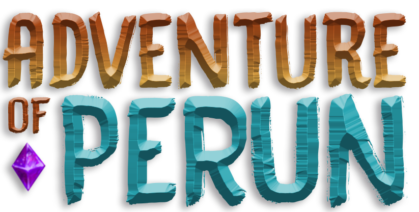

  
  
  <h2> <strong>Adventure Of Perun</strong> </h2>

  <h3>Descubra o mundo dos paradigmas</h3>

   [Introdução](#-introdução) |
   [Como jogar](#-como-jogar) |
   [Tecnologias Utilizadas](#-tecnologias-utilizadas) 

---

# 👨🏻‍💻 Introdução

## Objetivo

Mostrar de forma descontraída e prática os principais paradigmas de programação que utilizamos no dia a dia da programação.

## Esse repositório possui

Adventures of Perun:

- Build do jogo para Windows e WebGL
- Todas as artes, sons, músicas, telas e assets utilizados no desenvolvimento do jogo.
- Projeto completo do jogo e configurações da plataforma Unity, utilizada para o desenvolvimento.

## Projeto

Esse projeto foi idealizado enquanto os desenvolvedores cursavam a matéria de Paradigmas de Programação na Universidade de Goiás.

Durante a disciplina surgiu a necessidade de apresentar um projeto onde era necessário abordar os principais paradigmas e apresentar à turma. E assim foi criada a ideia das Aventuras de Perun no mundo dos paradigmas.

 

# 🎮 Como jogar

  
  

    
  

   

- **Rodando de forma nativa do windows:** 
  - Para rodar o jogo com essa build basta baixar a pasta `Windows` no caminho `./Compilações/Windows/` do repositório e executar o arquivo `AdventureOfPerun.exe` no seu computador.

   

  - > **AVISO:** O jogo foi desenvolvido em 2018 e a build feita para sistemas baseados em Windows 10. Caso o seu sistema seja mais recente poderá apresentar bugs e inconsistências durante a execução do jogo!

- **Rodando no navegador em um servidor web:** 
  - Para rodar o jogo no navegador baixe a compilação em `WebGL` na pasta do repositório `./Compilações/WebGL/`;
  - Execute a compilação usando um servidor web. Caso for rodar na sua máquina recomendo utilizar o [Express](https://expressjs.com/).

 

# 🚀 Tecnologias utilizadas

- [Unity](https://unity.com/)
- [C#](https://learn.microsoft.com/en-us/dotnet/csharp/)

---

Made by

- [**Gabriel Carvalho**](https://github.com/GabrielCarvf) `(UX/UI Designer / Development)` 🚀 [LinkedIn](https://www.linkedin.com/in/gabriel-carvalho-5ba636182//in/annabeatriznf/)
- [**Felipe Nedopetalski**](https://github.com/fNedopetalski) `(Game Script Writer / Development)` 👻 [LinkedIn](https://www.linkedin.com/in/felipe-nedopetalski-91b93b154/)
